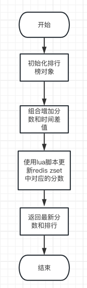
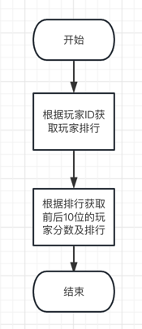

# ActivityRankSystem
活动排行榜系统

## 需求
>你开发了⼀个游戏，⽇活跃⽤户在10万⼈以上。请设计⼀个活动排⾏榜系统。 
>> * 在每⽉活动中，玩家得到的活动总分为 0 到 10000 之间的整数。 
>> * 在每⽉活动结束之后，需要依据这⼀活动总分，从⾼到低为玩家建⽴排⾏榜。 
>> * 如果多位玩家分数相同，则按得到指定分数顺序排序，先得到的玩家排在前⾯。 
>> * 系统提供玩家名次查询接⼝，玩家能够查询⾃⼰名次前后10位玩家的分数和名次。

## 目标
1.支持百万级排行

2.排序规则为：分数（正序）+ 获取到指定分数的时间（倒序）

3.支持查询某个玩家名次前、后各10位的玩家

## 存储设计
玩家排行数据存储到Redis ZSet中

|       key       | member |         score         |
|:---------------:|:------:|:---------------------:|
| ar:[year-month] |  玩家ID  | 分数.(活动结束时间-获取指定分数的时间) |

key: 年份和月份 eg: **ar:2023-07**

member: 玩家ID

score: 整数部分为实际分数 小数部分存 活动结束时间与获取指定分数时间的差值

## 接口设计

### 玩家排行榜分数增加接口

#### 请求方式
```
HTTP POST
```

#### 请求路径
```
/rank/update
```

#### 请求参数
```json
{
    "userId": "3",
    "score": 400
}
```

#### 响应参数
```json
{
    "UID": "6",
    "Val": 400,
    "Rank": 6
}
```

#### 流程图


### 玩家查询排名接口

#### 请求方式
```
HTTP GET
```

#### 请求路径
```
/rank/query
```

#### 请求参数
```
userId=3
```

#### 响应参数
```json
[
  {
    "UID": "1",
    "Val": 10000,
    "Rank": 1
  },
  {
    "UID": "2",
    "Val": 5000,
    "Rank": 2
  },
  {
    "UID": "3",
    "Val": 5000,
    "Rank": 3
  },
  {
    "UID": "4",
    "Val": 5000,
    "Rank": 4
  },
  {
    "UID": "5",
    "Val": 4000,
    "Rank": 5
  },
  {
    "UID": "6",
    "Val": 400,
    "Rank": 6
  }
]
```

#### 流程图
